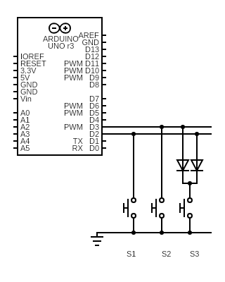
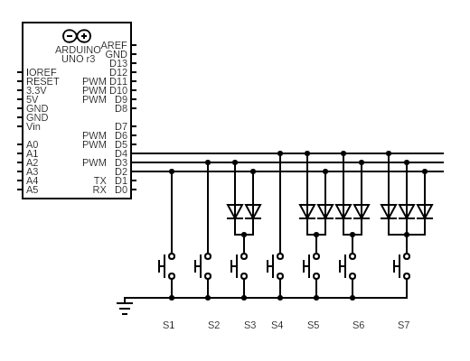
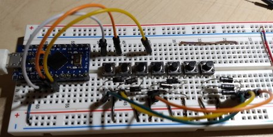

# Binary Encoding

When each button is connected to a single button, the number of pins increases
linearly with the number of buttons. If we have a limited number of pins,
we can support a larger number of buttons by using an encoding scheme.

One of the simplest encoding scheme is the [Binary
Encoding](http://www.learnabout-electronics.org/Digital/dig44.php). With 2
pins, we can distinguish 4 (`2^2`) different combinations. With 3
pins, we can distinguish 8 (`2^3`) different combinations. In general, the
number of possible states of `N` pins is (`2^N`). One combination must be used
to represent the condition of "no button pressed". So the number of buttons that
can be supported by `N` pins is `2^N - 1`.

There are at least 3 ways to wire up the buttons to binary encode their
activations into the smaller number of pins:
* diodes
* logical gates (AND, OR, NOT gates)
* integrated circuit, e.g. the [74LS148](https://www.ti.com/product/SN74LS148)

For small number of pins (2 or 3), diodes can be used to implement the binary
encoding. For 4 or more pins, the number of diodes increases exponentially, so
it is probably easier to use logic gates or integrated circuit.

One disadvantage of encoding multiple buttons into a small number of pins is
that it is no longer possible to detect multiple buttons being pressed at the
same time.

I created 2 special subclasses of `ButtonConfig` to support a 4-to-2 binary
encoding and an 8-to-3 binary encoding.

* `Encoded4To2ButtonConfig`
* `Encoded8To3ButtonConfig`

The software does not care how the binary encoding is actually implemented in
hardware.

## 4-to-2 Encoding

This is the simplest example of binary encoding. Using 2 pins, we can support 3
buttons with 2 diodes. Here is the circuit diagram:



Of the 4 possible states of 2 pins, the `00` state corresponding to S0 is used
to indicate "no button pressed". Therefore, we can support 3 buttons
(S1, S2, S3) with 2 pins. We will use the internal pullup resistor using the
`pinMode(PIN, INPUT_PULLUP)` call. The buttons pull the pins down to `LOW` when
pressed. The pin states of the 3 buttons are:
```
PIN0 = D2
PIN1 = D3

---+------+------+
Btn| PIN1 | PIN0 |
---+------+------+
 - | HIGH | HIGH |
S1 | HIGH |  LOW |
S2 |  LOW | HIGH |
S3 |  LOW |  LOW |
---+------+------+
```

The `Encoded4To2ButtonConfig` class allows us to assign "virtual" pin numbers to
the 3 buttons, like this:
```C++
#include <AceButton.h>
using namespace ace_button;

static const uint8_t BUTTON_PIN0 = 2;
static const uint8_t BUTTON_PIN1 = 3;

Encoded4To2ButtonConfig buttonConfig(BUTTON_PIN0, BUTTON_PIN1);

// Create 3 buttons, assigning them virtual pin numbers 1, 2 and 3.
AceButton b1(&buttonConfig, 1);
AceButton b2(&buttonConfig, 2);
AceButton b3(&buttonConfig, 3);

void handleEvent(AceButton*, uint8_t, uint8_t);

void setup() {
  delay(1000); // wait for stability
  Serial.begin(115200);
  while (! Serial); // Wait until Serial is ready - Leonardo/Micro

  // Configure the real pins for pullup wiring
  pinMode(BUTTON_PIN0, INPUT_PULLUP);
  pinMode(BUTTON_PIN1, INPUT_PULLUP);

  // Configure the ButtonConfig with the event handler, and enable all higher
  // level events.
  buttonConfig.setEventHandler(handleEvent);
  buttonConfig.setFeature(ButtonConfig::kFeatureClick);
  buttonConfig.setFeature(ButtonConfig::kFeatureDoubleClick);
  buttonConfig.setFeature(ButtonConfig::kFeatureLongPress);
  buttonConfig.setFeature(ButtonConfig::kFeatureRepeatPress);
}

void loop() {
  // Should be called every 4-5ms or faster, for the default debouncing time
  // of ~20ms.
  b1.check();
  b2.check();
  b3.check();
}

void handleEvent(AceButton* button, uint8_t eventType, uint8_t buttonState) {
  Serial.print(F("handleEvent(): "));
  Serial.print(F("virtualPin: "));
  Serial.print(button->getPin());
  Serial.print(F("; eventType: "));
  Serial.print(eventType);
  Serial.print(F("; buttonState: "));
  Serial.println(buttonState);
}
```

## 8-to-3 Encoding

If we use 3 pins, we can support 7 buttons (8 possible states of 3 pins, with
one state representing "no button" pressed). The binary encoding can be achieved
using 9 diodes, as shown in the following circuit:



Of the 8 possible states of 3 pins, the `000` state corresponding to S0 is used
to indicate "no button pressed". Therefore, we can support 7 buttons
(S1, S2, ..., S7) with 3 pins. We will use the internal pullup resistor using
the `pinMode(PIN, INPUT_PULLUP)` call. The buttons pull the pins down to `LOW`
when pressed. The pin states of the 3 buttons are:
```
PIN0 = D2
PIN1 = D3
PIN2 = D4

---+------+------+------+
Btn| PIN2 | PIN1 | PIN0 |
---+------+------+------+
 - | HIGH | HIGH | HIGH |
S1 | HIGH | HIGH |  LOW |
S2 | HIGH |  LOW | HIGH |
S3 | HIGH |  LOW |  LOW |
S4 |  LOW | HIGH | HIGH |
S5 |  LOW | HIGH |  LOW |
S6 |  LOW |  LOW | HIGH |
S7 |  LOW |  LOW |  LOW |
---+------+------+------+
```

The `Encoded8To3ButtonConfig` class allows us to assign "virtual" pin numbers to
the 7 buttons, like this:

```C++
#include <AceButton.h>
using namespace ace_button;

static const uint8_t BUTTON_PIN0 = 2;
static const uint8_t BUTTON_PIN1 = 3;
static const uint8_t BUTTON_PIN1 = 4;

Encoded8To3ButtonConfig buttonConfig(BUTTON_PIN0, BUTTON_PIN1, BUTTON_PIN2);

// Create 3 buttons, assigning them virtual pin numbers 1..7
AceButton b1(&buttonConfig, 1);
AceButton b2(&buttonConfig, 2);
AceButton b3(&buttonConfig, 3);
AceButton b4(&buttonConfig, 4);
AceButton b5(&buttonConfig, 5);
AceButton b6(&buttonConfig, 6);
AceButton b7(&buttonConfig, 7);

void handleEvent(AceButton*, uint8_t, uint8_t);

void setup() {
  delay(1000); // wait for stability
  Serial.begin(115200);
  while (! Serial); // Wait until Serial is ready - Leonardo/Micro

  // Configure the real pins for pullup wiring
  pinMode(BUTTON_PIN0, INPUT_PULLUP);
  pinMode(BUTTON_PIN1, INPUT_PULLUP);
  pinMode(BUTTON_PIN2, INPUT_PULLUP);

  // Configure the ButtonConfig with the event handler, and enable all higher
  // level events.
  buttonConfig.setEventHandler(handleEvent);
  buttonConfig.setFeature(ButtonConfig::kFeatureClick);
  buttonConfig.setFeature(ButtonConfig::kFeatureDoubleClick);
  buttonConfig.setFeature(ButtonConfig::kFeatureLongPress);
  buttonConfig.setFeature(ButtonConfig::kFeatureRepeatPress);
}

void loop() {
  // Should be called every 4-5ms or faster, for the default debouncing time
  // of ~20ms.
  b1.check();
  b2.check();
  b3.check();
  b4.check();
  b5.check();
  b6.check();
  b7.check();
}

void handleEvent(AceButton* button, uint8_t eventType, uint8_t buttonState) {
  Serial.print(F("handleEvent(): "));
  Serial.print(F("virtualPin: "));
  Serial.print(button->getPin());
  Serial.print(F("; eventType: "));
  Serial.print(eventType);
  Serial.print(F("; buttonState: "));
  Serial.println(buttonState);
}
```

## 16-to-4 Encoding

With 4 pins, we could theoretically support 15 buttons. If we used diodes to
implement this encoding, we would need 28 diodes (assuming I've counted the
diodes correctly).

An easier alternative might be to use 2 x
[74LS148](https://www.ti.com/product/SN74LS148) chips and chain them together as
indicated in the datasheet:


We would also need to create an `Encoded16To4ButtonConfig` class, which would
be a simple extension of the `Encoded8To3ButtonConfig` class. I have not created
this class, mostly because I am worried about the following inefficiency:

Each `AceButton.check()` method called in the `loop()` function causes a call to
`Encoded16To4ButtonConfig.readButton()` method, which in turn performs a
`digitalRead()` on each of the 4 pins, like this:

```C++
int readButton(uint8_t pin) override {
  int s0 = digitalRead(mPin0);
  int s1 = digitalRead(mPin1);
  int s2 = digitalRead(mPin2);
  int s3 = digitalRead(mPin2);

  [...]
}
```

There would be 15 buttons in the `loop()` function, like this:
```C++
void loop() {
  b1.check();
  b2.check();
  ...
  b14.check();
  b15.check();
}
```

Therefore, in each iteration of `loop()`, the `digitalRead()` method would get
called `15 * 4 = 60` times. The `digitalRead()` method on an Arduino platform is
known to be suboptimal in terms of CPU cycles. I need to perform some
benchmarking before I would be comfortable using `digitalRead()` 60 times in a
single iteration.

A possible work-around is to recognize that it is not necessary to read in the 4
data pins repeatedly for each of the 15 buttons. It is sufficient to make the 4
`digitalRead()` calls for the first `b1.check()` call, then cache this result
and re-use those values for the other 14 buttons (`b2` to `b15`). However,
implementing this optimization probably requires some non-trivial amount of
work.

## Example Program

The program at [examples/EncodedButtons](../../examples/EncodedButtons)
is a working example of the `Encoded4To2ButtonConfig` and
`Encoded8To3ButtonConfig` classes. It was tested using 7 buttons on a
breadboard:



## Appendix

_The `*.cddx` files were generated by https://www.circuit-diagram.org/_
